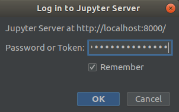
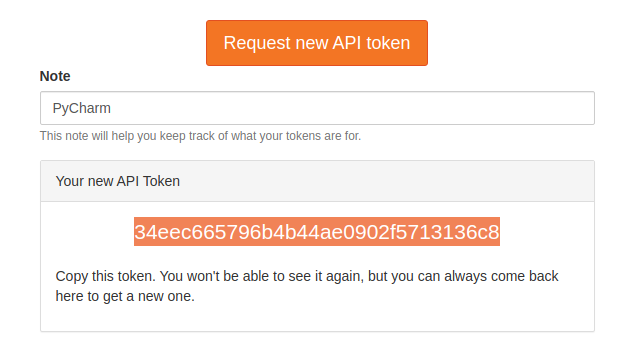

# PyCharm Jupyter Dev Server

The [proxy](proxy.py) in this repository allows a developer to connect the [PyCharm Professional IDE](https://www.jetbrains.com/pycharm/) running on a local machine to a remote [Jupyter](https://jupyter.org/) server [deployed on a Bright cluster](https://www.brightcomputing.com/blog/understanding-the-bright-cluster-manager-9.1-integration-with-jupyter).

While the proxy is running, developers can [configure an external Jupyter server in their IDE](https://www.jetbrains.com/help/pycharm/configuring-jupyter-notebook.html), by using the URL provided by the proxy.

Once done, they will be able to execute notebook cells in PyCharm Professional as they would do in the traditional JupyterLab web interface.
Code will be run via Jupyter kernels that are available for the users in the cluster (e.g. with local workload managers or Kubernetes).

A demo of this tool can be watched on this [YouTube video]().

This repository is used as a reference for this [Knowledge Base article](). 


## Overview

The [proxy](proxy.py) works as local HTTP server, intercepting requests to `localhost` and **appropriately** redirecting them to the Jupyter server deployed on the cluster.

By doing so, connecting to http://localhost:8000 will be equivalent to connecting to https://jupyter.of.your.organization:8000.

The reason why it is not possible for developers to set up a [configured server](https://www.jetbrains.com/help/pycharm/configuring-jupyter-notebook.html#configure-server) directly pointing to the Jupyter cluster without Bright's proxy is simple: at the time of writing (3 Aug, 2021), PyCharm Professional **does not support [JupyterHub](https://jupyter.org/hub)** out of the box, a fundamental component of Bright's Jupyter integration.

Due to this limitation, the IDE issues requests to the `/api/` endpoint rather than to `/user/<your_username>/api/`. The proxy will transparently redirect requests and allow proper connection.

For security reason, the traffic between the proxy and the remote Jupyter server deployed on the cluster is encrypted via SSL.


## Installation
On your local machine, where PyCharm Professional and Python 3 are installed, run:

```
$ PYCHARM_JUPYTER_DEV_SERVER_DIR="~/bin"  # set your favorite directory
$ mkdir -p ${PYCHARM_JUPYTER_DEV_SERVER_DIR}
$ pushd ${PYCHARM_JUPYTER_DEV_SERVER_DIR}
$ git clone https://github.com/Bright-Computing/pycharm-jupyter-dev-server.git
$ popd
```

## Usage
This step assumes:
* Jupyter is accessible at some IP or name (e.g. `1.2.3.4`); 
* a Jupyter user has been already created for you on the cluster (e.g. with username `myname`);
* you stored the **public key** of [the CA certificate](https://en.wikipedia.org/wiki/Certificate_authority) that was used to securely sign the Jupyter certificates on the cluster (e.g. on the file `~/my_sslca.cert`)

On your local machine, where the proxy has been installed in `${PYCHARM_JUPYTER_DEV_SERVER_DIR}`, you can run: 

```
$ JUPYTER_SERVER_IP_OR_NAME="1.2.3.4" \
 JUPYTER_USERNAME="myname" \
 JUPYTER_CLUSTER_CA_CERT="~/my_sslca.cert" \
 python3 ${PYCHARM_JUPYTER_DEV_SERVER_DIR}/proxy.py
```

You can (and should) customize the behaviour of the proxy by configuring the following environment variables (default values are provided in brackets):

* `JUPYTER_PROXY_IP_OR_NAME` (`localhost`);
* `JUPYTER_PROXY_PORT` (`8000`);
* `JUPYTER_SERVER_IP_OR_NAME` (`1.2.3.4`);
* `JUPYTER_SERVER_PORT` (`8000`);
* `JUPYTER_SERVER_NAME` (`jupyterhub`);
* `JUPYTER_USERNAME` (`myusername`);
* `JUPYTER_CLUSTER_CA_CERT` (`./my_sslca.cert`).

For convenience, you can permanently export them in your shell configuration file.

## Notes

### Authorization

Upon configuring your Jupyter server in PyCharm Professional, the IDE should automatically prompt you to type your Jupyter password/token to be able to issue requests to Jupyter:



We found out this authorization mechanism is somehow fragile and often leads to `401 Unauthorized` responses from the server.

For this reason, we recommend you initially setting up your configured server by directly embedding [your Jupyter API token](https://jupyterhub.readthedocs.io/en/stable/reference/rest.html).

Now, suppose you have created a new token for PyCharm with value `34eec665796b4b44ae0902f5713136c8`



and the proxy is running and listening at http://localhost:8000.

Now, upon configuring the Jupyter server in the IDE, instead of using the traditional URL:
```
http://localhost:8000/
```
use this one instead:
```
http://localhost:8000/?token=34eec665796b4b44ae0902f5713136c8
```

If you are experiencing issues with authorization we recommend you to try the followings in order:
1. use a different Jupyter kernel;
2. generate a new API token;
3. restart your own Jupyter server (doesn't require admin privileges);
4. generate a new API token (intentionally listed twice).


### Debugging

Debugging cells with PyCharm Professional will probably **not** work, because Jupyter kernels do not typically support PyCharm's debugger.
This is the case for kernels provided by Bright (e.g. with Bright's workload managers/Kubernetes support), but probably also for those created by your organization.

In theory, it should be possible to configure [remote debugging with PyCharm Professional](https://www.jetbrains.com/help/pycharm/remote-debugging-with-product.html).

In this scenario, the debugger must be executed next to the running kernel, perhaps within the context of a workload manager job.
This may be not straightforward to configure and it has never been tested by Bright.

If you are interested in this functionality, please contact us and let us know.
