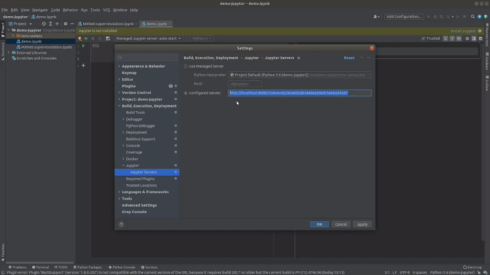
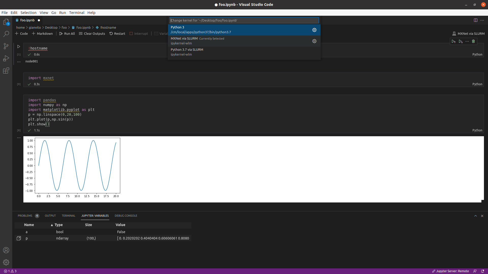

# Jupyter Dev Server

The [proxy](proxy.py) in this repository allows a developer to connect an integrated development environment (IDE) running on a local machine to a remote [Jupyter](https://jupyter.org/) server [deployed on a Bright cluster](https://www.brightcomputing.com/blog/understanding-the-bright-cluster-manager-9.1-integration-with-jupyter).

At the time of writing, September 2021, the `Jupyter Dev Server` has been successfully tested with [PyCharm Professional](https://www.jetbrains.com/pycharm/) and [Visual Studio Code](https://code.visualstudio.com/), but other IDEs may also be supported.

While the proxy is running, developers can configure an external (i.e. existing) Jupyter server in their IDE by using the URL provided by the proxy on startup.

Once done, they will be able to execute notebook cells in the IDE as they would do in the traditional JupyterLab web interface.
Code will be run via Jupyter kernels that are available for the users in the cluster (e.g. with local workload managers or Kubernetes).





A demo of this tool for [PyCharm Professional](https://www.jetbrains.com/pycharm/) can be watched on this [YouTube video](https://www.youtube.com/watch?v=fqOSfwtR1yI).

This repository is used as a reference for this [Knowledge Base article](https://kb.brightcomputing.com/knowledge-base/running-jupyter-kernels-with-pycharm/).


## Overview

The `Jupyter Dev Server` works as local HTTP server, intercepting requests to `localhost` and **appropriately** redirecting them to the Jupyter server deployed on the cluster.

By doing so, connecting to http://localhost:8000 will be equivalent to connecting to https://jupyter.of.your.organization:8000.

The reason why it is not usually possible for developers to set up a Jupyter server directly pointing to the Jupyter cluster without Bright's proxy is simple: IDEs **do not support [JupyterHub](https://jupyter.org/hub)** out of the box, a fundamental component of Bright's Jupyter integration.
Due to this limitation, the IDE issues requests to the `/api/` endpoint rather than to `/user/<your_username>/api/` and fails.

The [proxy](proxy.py) will bypass this limitation by transparently redirecting requests to allow proper connection.

For security reason, the traffic between the proxy and the remote Jupyter server deployed on the cluster is encrypted via SSL.
The traffic between the IDE and the proxy running locally does not need to be encrypted.


## Installation
On your local machine, where the IDE and Python 3 are installed, run:

```
$ export JUPYTER_DEV_SERVER_DIR="~/bin"  # set your favorite directory
$ mkdir -p ${JUPYTER_DEV_SERVER_DIR}
$ pushd ${JUPYTER_DEV_SERVER_DIR}
$ git clone https://github.com/Bright-Computing/jupyter-dev-server.git
$ popd
```


## Usage
This step assumes:
* Jupyter is accessible at some IP or name (e.g. `1.2.3.4`); 
* a Jupyter user has been already created for you on the cluster (e.g. with username `myname`);
* you stored the **public key** of [the CA certificate](https://en.wikipedia.org/wiki/Certificate_authority) that was used to securely sign the Jupyter certificates on the cluster (e.g. on the file `/path/to/my_sslca.cert`). By default, it can be found under `/cm/local/apps/jupyter/current/conf/certs/` in the Jupyter login node and can be shared by cluster administrators.

On your local machine, where the proxy has been installed in `${JUPYTER_DEV_SERVER_DIR}`, you can run: 

```
$ JUPYTER_SERVER_IP_OR_NAME="1.2.3.4" \
 JUPYTER_USERNAME="myname" \
 JUPYTER_CLUSTER_CA_CERT="/path/to/my_sslca.cert" \
 python3 ${JUPYTER_DEV_SERVER_DIR}/proxy.py
```

On startup, the `Jupyter Dev Server` will print the Jupyter server URL you should use to configure your IDE:
```
Authorization URL with token for IDE: http://1.2.3.4:8000/?token=<YOUR_API_TOKEN>
```

Please, remember to replace `<YOUR_API_TOKEN>` with your actual JupyterHub token.
If you don't have any token, follow [this guide to create a new one](https://jupyterhub.readthedocs.io/en/stable/reference/rest.html#create-an-api-token).

Finally, you can (and should) customize the behaviour of the proxy by configuring the following environment variables (default values are provided in brackets):

* `JUPYTER_PROXY_IP_OR_NAME` (`localhost`);
* `JUPYTER_PROXY_PORT` (`8000`);
* `JUPYTER_SERVER_IP_OR_NAME` (`1.2.3.4`);
* `JUPYTER_SERVER_PORT` (`8000`);
* `JUPYTER_SERVER_NAME` (`jupyterhub`);
* `JUPYTER_USERNAME` (`myusername`);
* `JUPYTER_CLUSTER_CA_CERT` (`./my_sslca.cert`).

For convenience, you can permanently export them in your shell configuration file:
```
export JUPYTER_SERVER_IP_OR_NAME="1.2.3.4"
export JUPYTER_USERNAME="myname"
export JUPYTER_CLUSTER_CA_CERT="/path/to/my_sslca.cert"
export JUPYTER_DEV_SERVER_DIR="~/bin"
```
and run the server as:
```
$ python3 ${JUPYTER_DEV_SERVER_DIR}/proxy.py
```


## IDE Configuration

### PyCharm Professional

PyCharm Professional natively [supports Jupyter Notebook](https://www.jetbrains.com/help/pycharm/configuring-jupyter-notebook.html).

At the time of writing, September 2021, the `Jupyter Dev Server` has been tested with the following version:
```
PyCharm 2021.2.1 (Professional Edition)
Build #PY-212.5080.64, built on August 25, 2021
Runtime version: 11.0.11+9-b1504.16 amd64
VM: OpenJDK 64-Bit Server VM by JetBrains s.r.o.
Linux 5.11.0-27-generic
Current Desktop: ubuntu:GNOME
```

A dedicated section of the PyCharm documentation describes how to [configure a remote Jupyter server](https://www.jetbrains.com/help/pycharm/configuring-jupyter-notebook.html#configure-server).

Please, remember to specify the URL provided by the running `Jupyter Dev Server` while configuring the IDE.


### Visual Studio Code

Visual Studio Code [supports Jupyter Notebook](https://code.visualstudio.com/docs/datascience/jupyter-notebooks) via the [Jupyter extension](https://marketplace.visualstudio.com/items?itemName=ms-toolsai.jupyter).

At the time of writing, September 2021, the `Jupyter Dev Server` has been tested with the following version:
```
Name: Jupyter
Id: ms-toolsai.jupyter
Description: Jupyter notebook support, interactive programming and computing that supports Intellisense, debugging and more.
Version: 2021.8.1236758218
Publisher: Microsoft
VS Marketplace Link: https://marketplace.visualstudio.com/items?itemName=ms-toolsai.jupyter
```

A dedicated section of the Visual Studio Code documentation describes how to [configure a remote Jupyter server](https://code.visualstudio.com/docs/datascience/jupyter-notebooks#_connect-to-a-remote-jupyter-server).

Please, remember to specify the URL provided by the running `Jupyter Dev Server` while configuring the IDE.


## Notes

### PyCharm Professional Authorization

Upon configuring your Jupyter server in PyCharm Professional, the IDE should automatically prompt you to type your Jupyter password/token to be able to issue requests to Jupyter:


We found out this authorization mechanism is somehow fragile and often leads to `401 Unauthorized` responses from the server.

For this reason, we recommend you initially setting up your configured server by directly embedding [your Jupyter API token](https://jupyterhub.readthedocs.io/en/stable/reference/rest.html).

Now, suppose you have created a new token for PyCharm with value `34eec665796b4b44ae0902f5713136c8`


and the proxy is running and listening at http://localhost:8000.

Now, upon configuring the Jupyter server in the IDE, instead of using the traditional URL:
```
http://localhost:8000/
```
use this one instead:
```
http://localhost:8000/?token=34eec665796b4b44ae0902f5713136c8
```

If you are experiencing issues with authorization we recommend you to try the followings in order:
1. use a different Jupyter kernel;
2. generate a new API token;
3. restart your own Jupyter server (doesn't require admin privileges);
4. generate a new API token (intentionally listed twice).


### Visual Studio Code Authorization

No problem was detected by Bright while authorizing Visual Studio Code to interact with Jupyter.

If you experience any issue, please follow the tips and recommendations described above for PyCharm Professional.


### Debugging

Debugging cells with your IDE will probably **not** work, because Jupyter kernels do not typically support third-party debuggers.
This is the case for kernels provided by Bright (e.g. with Bright's workload managers/Kubernetes support), but probably also for those created by your organization.

In theory, it should be possible to configure a remote debugger in your environment.
You should find a dedicated page in the documentation of your IDE, such as the one for [remote debugging with PyCharm Professional](https://www.jetbrains.com/help/pycharm/remote-debugging-with-product.html) or the one for [debugger extensions with Visual Studio Code](https://code.visualstudio.com/docs/editor/debugging#_debugger-extensions).

In this scenario, the debugger must be executed next to the running kernel, perhaps within the context of a workload manager job.
This may be not straightforward to configure and it has never been tested by Bright.

If you are interested in this functionality, please contact us and let us know.
